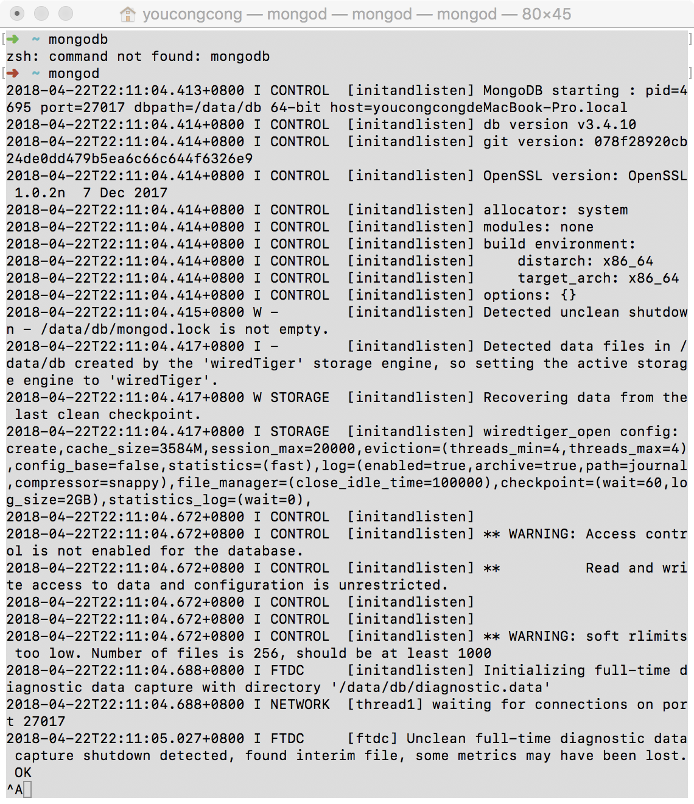
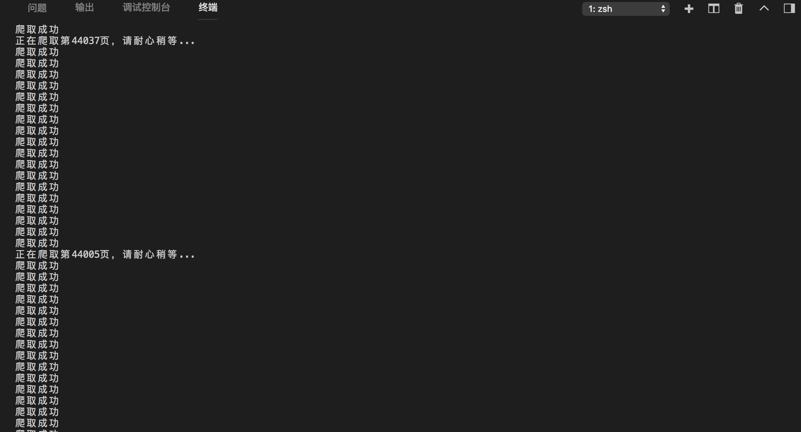
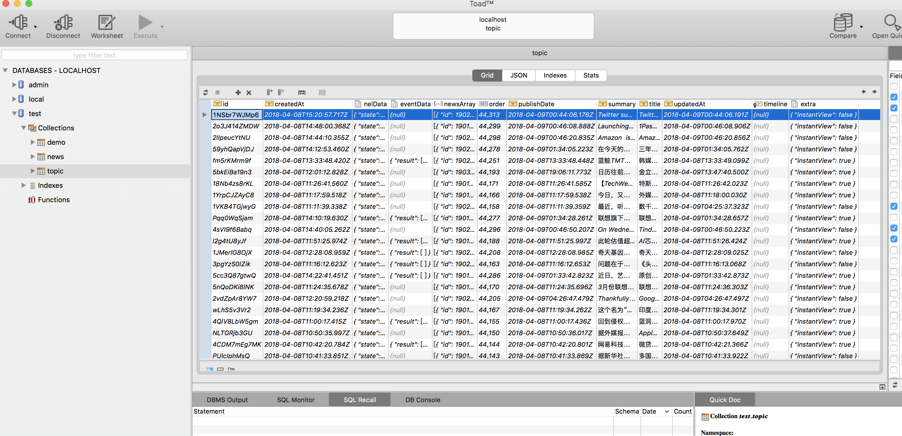

## 项目介绍 http://47.106.131.44/readhub/#/news

**高仿ReadHub，项目中整合 vue + node + mongodb + express + axios  + vue-router，一个前端全栈简单Demo**

## 完成功能列表

- [x] 爬虫爬取ReadHub网页数据并且存储到mongo数据库

- [x] 分页接口

- [x] vue全局过滤器

- [x] ReadHub热门话题

- [x] ReadHub科技动态

- [x] ReadHub开发者咨询

- [x] ReadHub区块链快讯

- [x] 滚动分页加载
- 
### 目录结构

<pre>
├── build			        // webpack及Node相关配置
├── config			        // 项目dev和prod环境的配置
├── dist			        // 项目build打包之后的目录
├── node_modules		    // npm包
├── index.html			    // 项目入口文件
├── package.json		    // 项目描述文件
├── markdownImg			    // 项目readme图
├── caught			        // 爬虫
│   ├── api.js				// 首页数据
│   ├── news.js             // 热点新闻数据
│   │          // 科技动态 router

├── server			        // node服务文件
│   ├── model				// 数据模型文件
│   │   ├──news.js          // 科技动态 model
│   │   ├──topic.js         // 热门话题 model
│   ├── router				// 
│   │   ├──api.js           // 热门话题 router
│   │   ├──news.js          // 科技动态 router
│   └── personal			// 个人中心控制器，包括资料修改、头像上传等
├── src					// 前端目录
│   ├── assets				// 图片资源
│   ├── components			// 项目所有组件，每个文件头部都有组件名称注释
│   ├── router				// Vue路由
│   ├── filter				// 定义过滤器文件
│   ├── pages               // 业务页面
│   ├── utils               // 通用方法文件
│   ├── permission.js       // 对路由做一系列操作
│   ├── App.vue				// 主页面 
│   └── main.js				// Webpack 预编译入口
├── static			// 前端公用静态文件目录
│   ├── css         
│   ├── images          
│   ├── js     
│   ├── less         
│   └── upload
├── .babelrc			// ES6等babel的一些配置
├── .editorconfig		// 编辑器的一些配置
├── .eslintignore		// 忽略语法检查的目录文件，一般是忽略build和config目录
├── .eslintrc.js		// eslint的配置文件

</pre>

## 一、效果图


看完最终完成的效果图，接下来，开始我们的实战之旅吧 ~

#### 1、第一步安装mongodb与可视化工具（Toad.app）
**Mac 下安装 MongoDB 一般有两种方法，一种是通过源码安装，一种是直接使用 homebrew ，个人推荐使用 homebrew ，简单粗暴。**
##### 1.1 安装 homebrew ：

```
/usr/bin/ruby -e "$(curl -fsSL https://raw.githubusercontent.com/Homebrew/install/master/install)"
```
##### 2.2 使用 homebrew 安装 MongoDB ：

```
brew install mongodb

```
**安装成功后，我们来尝试启动服务端**

```
mongod
```
**显示下图我们的mongodb就成功启动.**



#### 1、第一步通过node脚本爬取数据并且存到mongo

**前提我们需要 npm install下载package.json的配置**
```
var axios = require('axios')//请求模块
var cheerio = require('cheerio')//网页解析 JQ抓取
var mongoose = require('mongoose')//mongoose模块
var uuidgo = require('uuid/v4');//生成唯一ID
var url = 'https://api.readhub.me/topic?pageSize=20&lastCursor='//爬虫地址
var i = 44158;   // readhub 接口请求规律 拿每次请求回最后一条order的值 后面每次拿回数据都会保存给i => i = data[data.length-1].order;
mongoose.Promise = global.Promise;
//修改数据库 连接地址  没有表他会自动创建
mongoose.connect('mongodb://127.0.0.1:27017/test', {useMongoClient: true});
var connection = mongoose.connection;
connection.once('open', () => {
    console.log('连接MongoDB成功')
})
connection.on('error', () => {
    console.log('连接错误')
})
// 每次保存的数据。
var saveData = (docs, page) => {
    return new Promise((resolve, reject) => {
        //逐条插入到表topic中
        connection.collection('topic').insert(docs)
    })
}
var spider = () => {
    console.log(`正在爬取第${i}页，请耐心稍等...`);
    axios.get(`${url}${i}`).then(async res => {
        if( res.status === 200 ) {
            let data = res.data.data;
            let data1 = res.data.data
            // 保存到MongoDB
            i = data[data.length-1].order;
            for(var a=1;a<data.length-1;a++){
                saveData(data[a], i);
            }
            spider();
        }
    })
    .catch(e => {
        console.log('爬取出错或超时');
        spider();
    })
}
spider();
```
**然后我们启动上面的脚本**

```
cd caught
node api.js
```
**我们可以看下输出日志**

**这个时候我们通过可视化工具Toad，可以看到表topic的数据**



